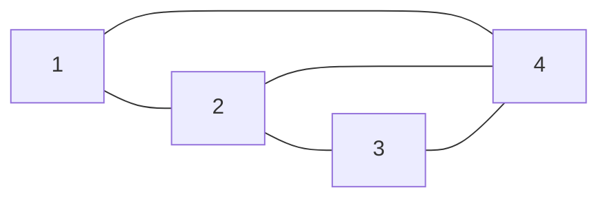
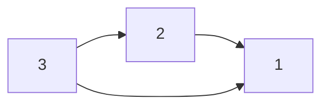
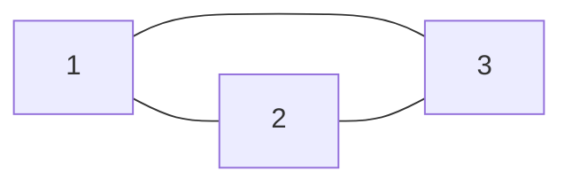
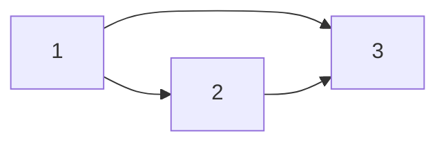

# Grafos: Lista e Matriz de Adjacência

- **Data:** 07/08/2026
- **Disciplina:** Teoria dos Grafos / Algoritmos e Estruturas de Dados
- **Tópicos:** Lista de Adjacência, Matriz de Adjacência, Grafos Orientados e Não Orientados

---

## 1. Lista de Adjacência

- **Conceito:** Forma de representação que indica quem está conectado com quem (apenas vértices adjacentes).

### 1.1. Grafos Não Orientados
- **Características:** São grafos cujas conexões possuem "ida e volta" (são bidirecionais).

#### Desenho do Grafo:

#### Exemplo:
- **Vértices:** $1, 2, 3, 4$

| Vértice ($V$) | Conexão ($C$) |
| :---: | :---: |
| **1** | 2, 4 |
| **2** | 1, 3, 4 |
| **3** | 2, 4 |
| **4** | 1, 2, 3 |

---

### 1.2. Grafos Orientados
- **Características:** São grafos cujas conexões possuem "via única" (orientação definida por setas).

#### Desenho do Grafo:

#### Exemplo:
- **Vértices:** $1, 2, 3$
- **Arestas:** $2 \to 1$, $3 \to 2$, $3 \to 1$

| Vértice ($V$) | Conexão ($C$) |
| :---: | :---: |
| **1** | — |
| **2** | 1 |
| **3** | 2, 1 |

---

## 2. Matriz de Adjacência

- **Conceito:** Forma de expressar quais vértices ($V$) se conectam por meio de uma matriz.

### 2.1. Grafo Não Orientado

#### Exemplo (`exp`):
- Grafo não orientado com 3 vértices ($1, 2, 3$) totalmente conectados entre si (triângulo $K_3$).

#### Desenho do Grafo:

**Matriz de Adjacência:**

$$
\begin{pmatrix}
 & \mathbf{1} & \mathbf{2} & \mathbf{3} \\
\mathbf{1} & 0 & 1 & 1 \\
\mathbf{2} & 1 & 0 & 1 \\
\mathbf{3} & 1 & 1 & 0
\end{pmatrix}
$$

| Vertices | 1 | 2 | 3 |
| :---: | :---: | :---: | :---: |
| **1** | 0 | 1 | 1 |
| **2** | 1 | 0 | 1 |
| **3** | 1 | 1 | 0 |

---

### 2.2. Grafo Orientado

#### Exemplo:
- Grafo orientado com 3 vértices ($1, 2, 3$), onde $1 \to 2$, $1 \to 3$ e $2 \to 3$.

#### Desenho do Grafo:

**Matriz de Adjacência:**

$$
\begin{pmatrix}
 & \mathbf{1} & \mathbf{2} & \mathbf{3} \\
\mathbf{1} & 0 & 1 & 1 \\
\mathbf{2} & 0 & 0 & 1 \\
\mathbf{3} & 0 & 0 & 0
\end{pmatrix}
$$

| Vertices | 1 | 2 | 3 |
| :---: | :---: | :---: | :---: |
| **1** | 0 | 1 | 1 |
| **2** | 0 | 0 | 1 |
| **3** | 0 | 0 | 0 |
